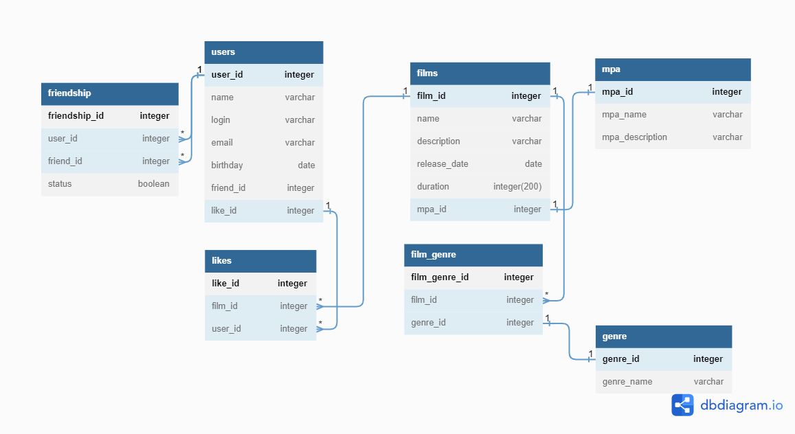

# java-filmorate

Template repository for Filmorate project.



**Описание диаграммы базы данных проекта Filmorate:**

***БД состоит из 7-ми таблиц, каждая из которых содержит в себе***

***все необходимые данные для корректной работы приложения по***

***выбору фильмов.***

Таблица **users** содержит данные о пользователе
(primary key - user_id, foreign keys - friend_id, like_id).

Включает поля:

*user_id* - идентификатор пользователя;

*name* - имя пользователя;

*login* - логин пользователя;

*email* - электронная почта пользователя;

*birthday* - дата рождения пользователя;

*friend_id* - наличие/отсутствие друзей у пользователя;

*like_id* - лайк фиьму

Таблица **films** содержит данные о фильме
(primary key - film_id, foreign keys - mpa_id).

Включает поля:

*film_id* - идентификатор фильма ;

*name* - название фильма;

*description* - краткое описание фильма(не более 200 символов);

*release_date* - дата выхода фильма (релиз);

*duration* - продолжительность фильма;

*mpa_id* - внешний ключ, идентификатор жанра, отсылает к таблице mpa.

Таблица **film_genre** содержит информацию о жанрах фильма
(primary key - film_genre_id, foreign keys - film_id, genre_id);

Содержит поля:
**film_genre_id** - идентификатор, определяющий жанр фильма

*film_id* - идентификатор фильма;

*genre_id* - идентификатор жанра, отсылает к таблице genre.

Таблица **genre** содержит информацию о жанрах фильма
(primary key - genre_id).

Содержит поля:

*genre_id* - первичный ключ, идентиикатор жанра ;

*genre_name* - название жанра, а именно:

Комедия.

Драма.

Мультфильм.

Триллер.

Документальный.

Боевик.

Таблица **mpa** содержит рейтинг Ассоциации кинокомпаний

(англ. Motion Picture Association, сокращённо МРА)

Эта оценка определяет возрастное ограничение для фильма.
(primary key - mpa_id).

Включает следующие поля:

*mpa_id* - идентификатор рейтинга;

*mpa_name* - названия рейтинга;

*mpa_description* - описание рейтинга,

Значения могут быть следующими:

G — у фильма нет возрастных ограничений,

PG — детям рекомендуется смотреть фильм с родителями,

PG-13 — детям до 13 лет просмотр не желателен,

R — лицам до 17 лет просматривать фильм можно только в присутствии взрослого,

NC-17 — лицам до 18 лет просмотр запрещён.

Таблица **likes** содержит информацию о понравившихся фильмах пользователям.
(primary key - like_id, foreign keys - user_id, film_id)

Содержит следующие поля:

*like_id* - идентификатор лайка ;

*film_id* - идентификатор фильма, которому пользователь поставил лайк;

*user_id* - идентификатор пользователя, поставившего лайк фильму.

Таблица **friendship** содержит информацию о дружбе пользователей
(primary key - friendship_id, foreign keys - user_id, friend_id).

Включает поля:

*friendship_id* - идентификатор дружбы;

*user_id* - идентификатор пользователя;

*friend_id* - идентификатор пользователя(обозначен другой пользователь);

*status* - дружба пользователей имеет два значения:

-неподтверждённая (когда один пользователь отправил запрос на добавление
другого пользователя в друзья)

status = false — в таблице одна запись о дружбе двух пользователей(id1 = id2);

-подтверждённая (когда второй пользователь согласился на добавление)

status = true — в таблице две записи о дружбе двух пользователей (id1 = id2; id2 = id1);

***Примеры запросов для получения данных:***

**Добавить пользователя**

```
INSERT INTO users (name, login, email, birthday)
VALUES ( 'Кое-кто', 'login', 'koe_kto@mail.ru', '1984-03-22');
```

**Удалить пользователя с именем Name**

```
DELETE FROM users WHERE name = 'Name';
```

**Обновить имя пользователя**

```
UPDATE users SET name = 'Name1' WHERE name = 'Name';
```

**Проверка на подтверждение дружбы:**

```
SELECT*
FROM friendship
WHERE (user_id = :user_id OR friend_id = :user_id)
AND status = "CONFIRMED";
```

**Выбрать все фильмы с определённым жанром, рейтингом, вышедшие в 2010 году:**

```
SELECT f.name
FROM films AS f
INNER JOIN mpa AS m ON m.mpa_id = f.mpa_id
INNER JOIN film_genre AS fg ON fg.film_id = f.film_id
INNER JOIN genre AS g ON g.genre_id = fg.genre_id
WHERE f.realiseDate = EXTRACT(YEAR FROM CAST date) "2010"
AND m.mpa_name = "G"
AND g.genre_name = "Триллер";
```

**Выбрать все фильмы и количество лайков, вышедшие в 2016 году с рейтингом RG-13,
с наибольшим количеством лайков, отсортировать по убыванию.**

```
SELECT f.name,
COUNT(l.user_id) AS count_likes
FROM films AS f
INNER JOIN mpa AS m ON m.mpa_id = f.mpa_id
INNER JOIN likes AS l ON l.film_id = f.film_id
WHERE f.realiseDate = EXTRACT(YEAR FROM CAST date) "2010"
AND m.mpa_name = "RG-13"
ORDER BY count_likes DESC;
```

**Вывести количество пользователей с именем "Раиса",
которым понравился фильм "Безумный Макс. Дорога ярости".**

```
SELECT COUNT(u.user_id)
FROM users AS u
LEFT OUTER JOIN likes AS l ON l.user_id = u.user_id
INNER JOIN film AS f ON l.film_id = f.film_id
WHERE u.name = "Раиса" AND f.name = "Безумный Макс. Дорога ярости";
```

:sunglasses:


